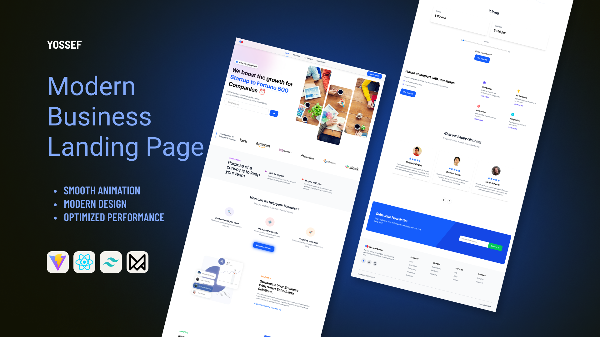

# Modern Business Landing Page

A sleek and responsive **landing page** designed for startups and **enterprise-level businesses**. It features smooth **Framer Motion animations**, **modern UI components**, and a **clean layout** that emphasizes clarity and conversion. Built with **Vite**, **React**, and **Tailwind CSS** for **fast performance** and **easy customization**.

## Preview




[Live Demo](https://wolf-root.github.io/landing-page)

---

## Table of Contents

- [Modern Business Landing Page](#modern-business-landing-page)
  - [Preview](#preview)
  - [Table of Contents](#table-of-contents)
  - [About](#about)
  - [Features](#features)
  - [Tech Stack](#tech-stack)
  - [Installation](#installation)
  - [🤝 Contributing](#-contributing)
  - [License](#license)

---

## About

This Landing Page is a **pure Front End** project, crafted to serve as a modern and engaging interface for business services and enterprise solutions. The design prioritizes:

- **Visual Trust:** By prominently displaying logos of trusted partners and clients (as seen in the design).
- **Clear Structure:** Content is segmented to present core features and solutions in an organized manner.
- **Advanced UX:** Utilizes smooth animations and pre-built UI components for a seamless browsing experience.

---

## Features

- **Fully Responsive Design 📱:** Adapts perfectly across all screen sizes (Desktop, Tablet, Mobile).
- **Advanced Animations:** Integration of **Framer Motion** for smooth entrance transitions and interactive elements.
- **Trust Banners:** Dedicated sections to showcase logos of major companies (like Amazon, Slack) to build credibility.
- **Modern UI Components:** Includes feature cards, a clear **Pricing** section with toggle functionality, and mockups for data visualization.
- **Testimonials Section:** A visually appealing area for displaying customer feedback.
- **Prominent Call-to-Action (CTA):** A high-visibility subscription form at the bottom of the page to drive conversion.

---

## Tech Stack

This project showcases proficiency with cutting-edge front-end technologies:

- **Vite** - Extremely fast bundler used for development and production builds.
- **React** - The core JavaScript library for building interactive user interfaces via components.
- **Tailwind CSS** - A utility-first CSS framework enabling rapid, custom styling without writing custom CSS files.
- **Framer Motion** - A powerful, declarative animation library specifically for React.

---

## Installation

1. Clone the repository:

```bash
git clone https://github.com/Wolf-Root/landing-page.git
```

💡 Or simply click the green "Code" button and choose "Download ZIP", then extract it.

2. Install dependencies:

```bash
npm install
```

Or

```bash
yarn install
```

3. Run the development server:

```bash
npm run dev
```

Or

```bash
yarn dev
```

4. Open the project in your browser:
   Visit 👉 http://localhost:5173

---

## 🤝 Contributing

Contributions are welcome!  
If you'd like to improve the project, please fork the repo and create a pull request.

---

## License

This project is distributed under the MIT License. See LICENSE for more information.
